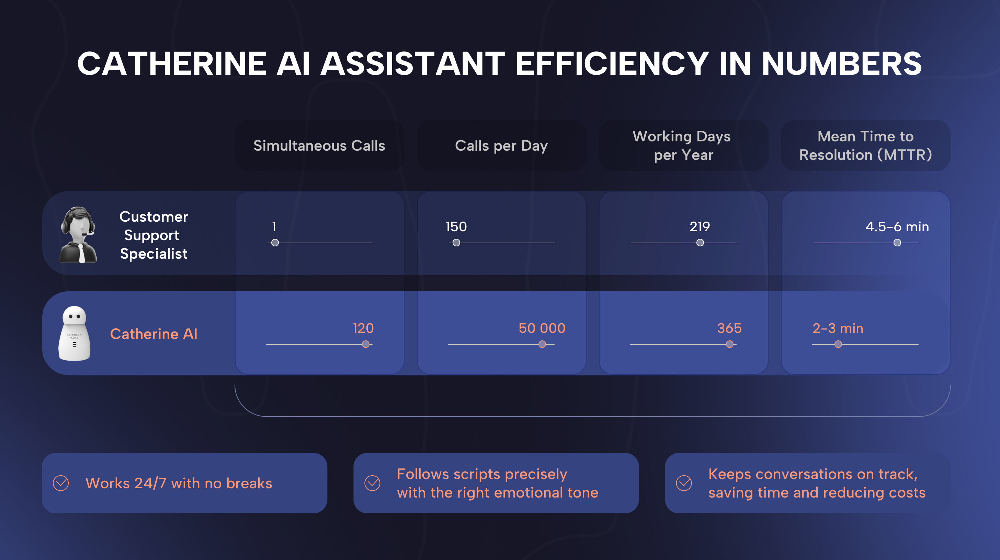

# Catherine AI in Action

Catherine AI transforms customer interactions, showcasing its effectiveness in real-world business scenarios.

Designed to alleviate the burden of routine conversations, it ensures seamless and stable operation, which is essential for consistent customer engagement. Integrated into business operations, Catherine AI efficiently distributes and processes incoming inquiries, directing them to the appropriate departments—such as routing a customer query to sales or support—saving time and improving response rates.

Its self-learning system retains conversations, continuously improving its responses based on past interactions, which enhances accuracy over time. With natural speech nearly indistinguishable from a human, Catherine AI manages intonation to maintain a professional and friendly tone, ensuring customers feel valued and respected.

<figure><figcaption></figcaption></figure>

For example, in a retail setting, it can handle product inquiries, process orders, and provide personalized recommendations, reducing staff workload by 40% while increasing customer satisfaction, as demonstrated in our case studies. This efficiency makes Catherine AI an invaluable asset for businesses aiming to streamline operations and elevate customer experience.

\
